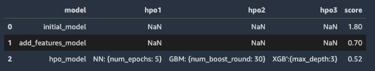
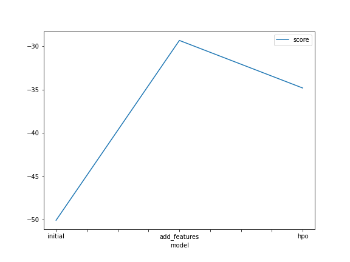
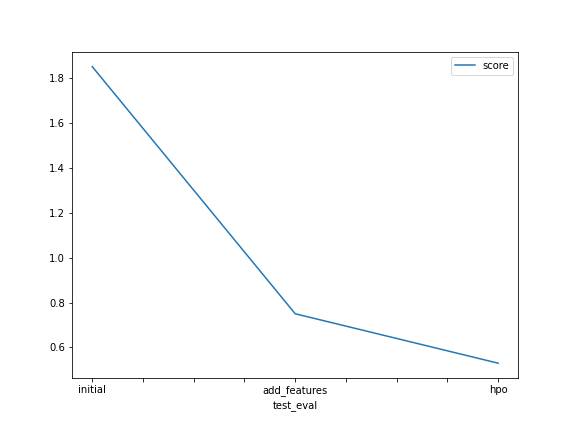
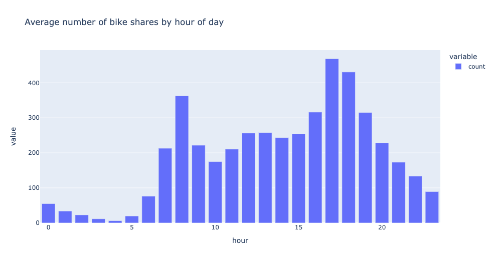
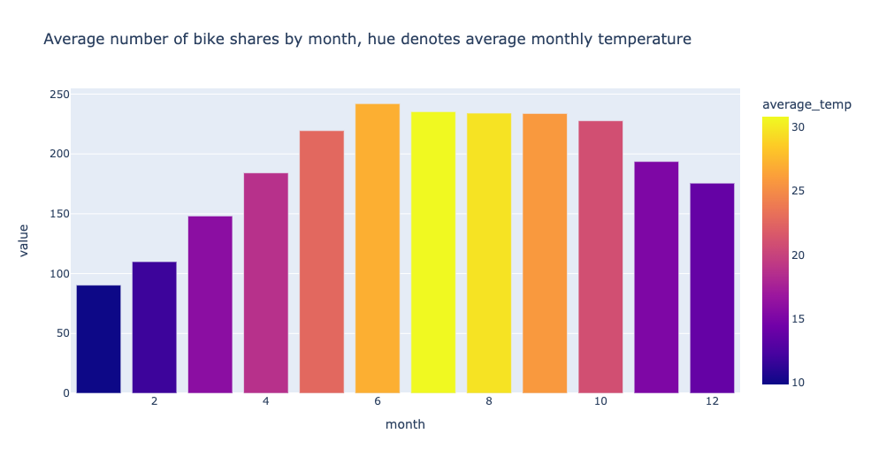

# Report: Predict Bike Sharing Demand with AutoGluon Solution
#### Sam Ho

## Initial Training
### What did you realize when you tried to submit your predictions? What changes were needed to the output of the predictor to submit your results?
Negative scores aren't accepted by Kaggle so I used numpy to transform any negative values to 0

### What was the top ranked model that performed?
The strongest performing model was the model that implemented both new features AND some
hyper-parameter optimisation.

## Exploratory data analysis and feature creation
### What did the exploratory analysis find and how did you add additional features?
Some of the continuous variables were skewed - specifically `wind speed`.

`Temp` and `atemp` looked normally distributed.

In terms of extra features - I parsed out the date and created separate features for hour, day, month
and year.

### How much better did your model preform after adding additional features and why do you think that is?
It improved the model score quite substantially. By adding more features we increase variance in the data which helps improve model
performance as there is more signal for out models to learn from.

## Hyper parameter tuning
### How much better did your model perform after trying different hyper parameters?
I tuned three models with one parameter each - NN, GBM and XGB. This made for a slightly worse validation
score however the score when submitted on Kaggle was an improvement on the feature addition alone.

### If you were given more time with this dataset, where do you think you would spend more time?
I would have taken some of the stronger performing models and done deeper hyper parameter tuning using
a wider range of values. Perhaps implement a random search or grid search to do this.

We could also consider transforming our y variable (count). Some possible options would be a log
transformation, z-score transformation or even rank percentile transformation.

### Create a table with the models you ran, the hyperparameters modified, and the kaggle score.

### Create a line plot showing the top model score for the three (or more) training runs during the project.

### Create a line plot showing the top kaggle score for the three (or more) prediction submissions during the project.

### More EDA Plots

## Summary
So in summary I took the data set and created new features from the existing feature space. By doing this alongside some
hyper-parameter tuning, I managed to improve model performance. To improve the performance even further some new features may helps us - this could be
from the existing feature space or even finding some new data and combining data sets such as population statistics.

Transformations of the target variable could also be something we experiment with in order to improve model performance.
